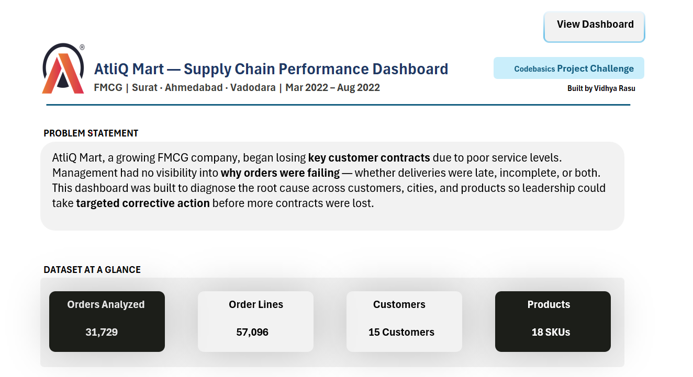
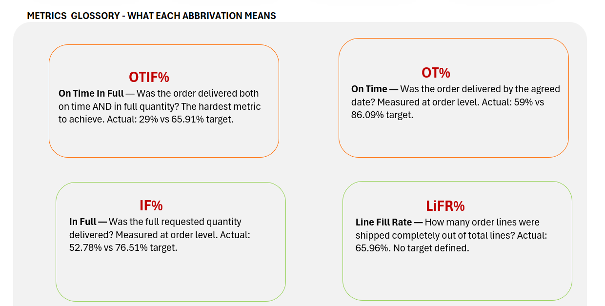
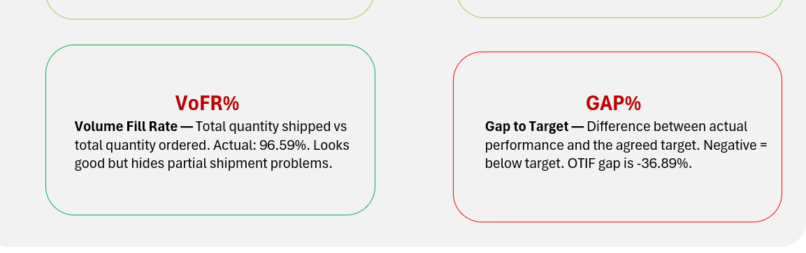
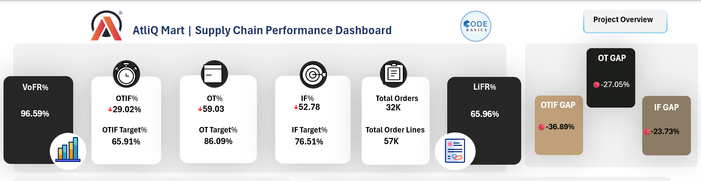
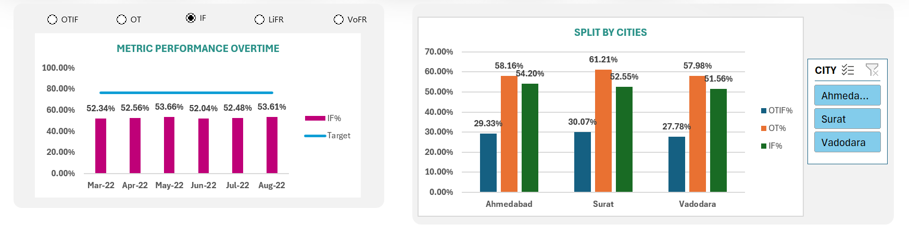
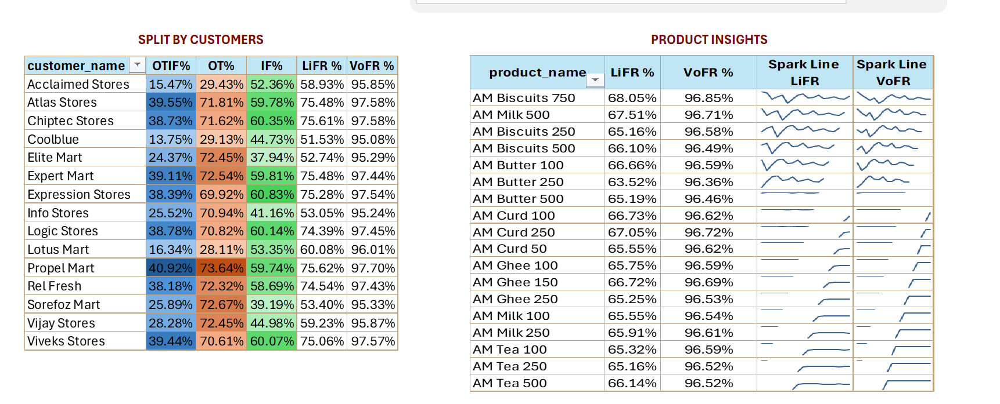
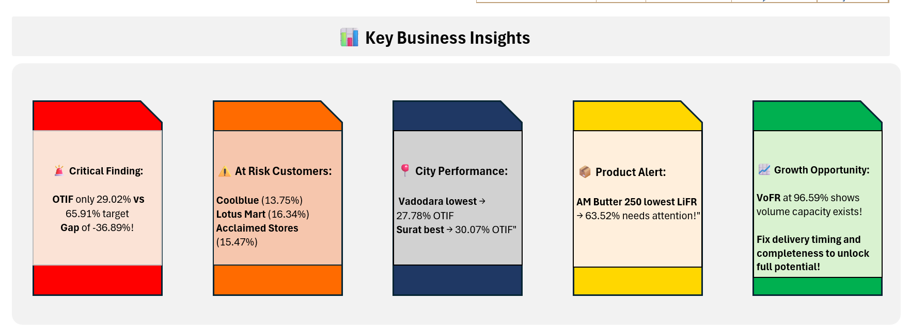

# 📦 AtliQ Mart | Supply Chain Performance Dashboard


> **An end-to-end Excel Business Intelligence dashboard** analyzing supply chain performance for AtliQ Mart — a growing FMCG company losing key customer contracts due to poor service levels.

---

## Project Overview

| Detail | Info |
|---|---|
| **Company** | AtliQ Mart (FMCG) |
| **Cities** | Surat · Ahmedabad · Vadodara |
| **Period** | March 2022 – August 2022 |
| **Orders Analyzed** | 31,729 orders · 57,096 order lines |
| **Customers** | 15 customers |
| **Products** | 18 SKUs across Dairy & Food categories |
| **Tool** | Microsoft Excel (End-to-End) |
| **Course** | Codebasics — Excel: Mother of Business Intelligence |

---

## Problem Statement

AtliQ Mart, a growing FMCG company operating across 3 cities in India, began **losing key customer contracts** due to consistently poor service levels. Management had no visibility into why orders were failing — whether deliveries were late, incomplete, or both.

This dashboard was built to **diagnose the root cause** across customers, cities, and products so leadership could take targeted corrective action before more contracts were lost.

---

## Dashboard Preview

> Screenshots below — download the Excel file for full interactivity

### Overview Page




### KPI Cards & Gap Metrics


### Trend Chart & City Split


### Customer Matrix & Product Insights


### Key Business Insights


---

## 📐 Data Model

Built using a **Star Schema** with 6 tables connected via Power Pivot relationships:

```
dim_customers      ──→  fact_order_lines
dim_products       ──→  fact_order_lines
dim_date           ──→  fact_order_lines
dim_customers      ──→  fact_orders_aggregate
dim_date           ──→  fact_orders_aggregate
dim_targets_orders ──→  fact_orders_aggregate
```

| Table | Rows | Description |
|---|---|---|
| `fact_order_lines` | 57,096 | Each product line within every order |
| `fact_orders_aggregate` | 31,729 | OT / IF / OTIF flags per order |
| `dim_customers` | 35 | Customer names and cities |
| `dim_products` | 18 | Product names and categories |
| `dim_date` | 183 | Daily, monthly, and week-number calendar |
| `dim_targets_orders` | 35 | OT, IF, OTIF targets per customer |

---

## Metrics Glossary

| Metric | Full Name | Definition |
|---|---|---|
| **OTIF%** | On Time In Full | Order delivered both on time AND in full quantity — the hardest metric |
| **OT%** | On Time | Order delivered by the agreed date — measured at order level |
| **IF%** | In Full | Full requested quantity delivered — measured at order level |
| **LiFR%** | Line Fill Rate | Order lines shipped completely out of total lines ordered |
| **VoFR%** | Volume Fill Rate | Total quantity shipped vs total quantity ordered |
| **GAP%** | Gap to Target | Difference between actual and target — negative = below target |

---

## Key Business Insights

### 1.Critical — OTIF Only 29.02% vs 65.91% Target
The overall OTIF is **less than half the target** with a gap of **-36.89%**. This means 7 out of 10 orders are failing to meet both timing and quantity requirements simultaneously.

### 2.At-Risk Customers
Three customers have critically low OTIF scores:

| Customer | OTIF% |
|---|---|
| Coolblue | 13.75% |
| Acclaimed Stores | 15.47% |
| Lotus Mart | 16.34% |

These customers are at highest risk of contract non-renewal.

### 3.City Performance
| City | OTIF% |
|---|---|
| Vadodara | 27.78% ← Lowest |
| Ahmedabad | 28.92% |
| Surat | 30.07% ← Best |

All 3 cities are severely below target — this is a company-wide issue, not city-specific.

### 4.Product Alert
**AM Butter 250** has the lowest Line Fill Rate at **63.52%** — indicating consistent stock or supply planning issues for this SKU.

### 5.VoFR vs LiFR — The Hidden Problem
VoFR at **96.59%** looks great on the surface — but LiFR is only **65.96%**. This means AtliQ Mart ships most of the **volume** but frequently fails to fulfill **complete order lines**. Partial shipments are masking the real fulfillment problem.

---

## Tools & Excel Skills Demonstrated

| Category | Skills |
|---|---|
| **Data Preparation** | Power Query — data cleaning & transformation |
| **Data Modeling** | Power Pivot — Star Schema with 6 relationships |
| **Calculations** | DAX Measures — 13 custom measures |
| **Analysis** | Pivot Tables — 7 pivot tables |
| **Visualization** | Combo Charts, Sparklines, Conditional Formatting |
| **Interactivity** | Radio Buttons (Form Controls), Slicers, Linked Pictures |
| **Design** | Dashboard layout, KPI cards, Insight cards |
| **Navigation** | Multi-sheet workbook with hyperlink buttons |

### DAX Measures Built (13 total)
`OT%` · `IF%` · `OTIF%` · `LiFR%` · `VoFR%` · `OT Target%` · `IF Target%` · `OTIF Target%` · `OT Gap%` · `IF Gap%` · `OTIF Gap%` · `Total Orders` · `Total Order Lines`

---

## Repository Structure

```
atliq-mart-supply-chain-excel/
│
├── AtliQ_Mart_Dashboard.xlsx       ← Main dashboard file
├── 📁 data/
│   ├── dim_customers.csv
│   ├── dim_products.csv
│   ├── dim_date.csv
│   ├── dim_targets_orders.csv
│   ├── fact_order_lines.csv
│   └── fact_orders_aggregate.csv
├── 📁 screenshots/
│   ├── overview_1.png       
│   ├── overview_2.png       
│   ├── overview_3.png        
│   ├── kpi_cards.png
│   ├── trend_city.png
│   ├── customer_product.png
│   └── insights.png
└── README.md
```

---

## How to Use

1. **Download** `AtliQ_Mart_Dashboard.xlsx`
2. Open in **Microsoft Excel** (2016 or later recommended)
3. Start on the **Overview** sheet to understand the project context
4. Click **"View Dashboard →"** to navigate to the interactive dashboard
5. Use **radio buttons** to switch between metrics on the trend chart
6. Use **city slicer** to filter the city split chart
7. Click **"← Project Overview"** to return to the overview page

> ⚠️ This file requires Microsoft Excel — Google Sheets does not support Power Pivot or Form Controls

---

## Certificate

This project was completed as part of the **Codebasics Resume Project Challenge C2 — FMCG Supply Chain**.

 **Course:** Excel: Mother of Business Intelligence  
**Platform:** Codebasics  
**Completed:** March 22, 2026  
**GUID:** CB-51-556403

---

## About Me

**Vidhya Rasu** — Data Analyst | SQL · Power BI · Excel · Python  
📍 Dallas, TX | US Citizen  
🔗 [LinkedIn](https://www.linkedin.com/posts/vidhya-rasu-74a9b31a5_codebasics-dataanalytics-excel-activity-7445489857662988288-b_0k?utm_source=share&utm_medium=member_desktop&rcm=ACoAADAGD2oBe0MTbjIdTWmtLFyFNgz6dcAwWHA) · [GitHub](https://github.com/vrasup)

---

*Built with Microsoft Excel as part of the Codebasics Resume Project Challenge*
